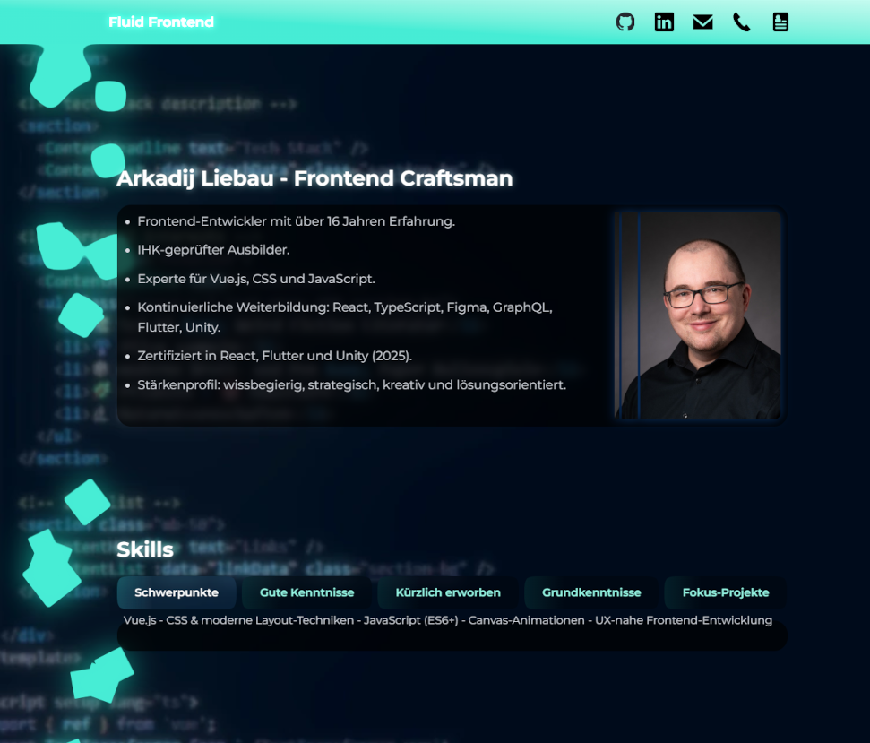

# 📄 Web Pres Lieb - Fluid Frontend

### Author: Arkadij Liebau

## ✨ Overview

This repository contains a responsive onepager, that features an animated gooey-background as well as a text-transformation component (which briefly explains the appllied technologies). In addition there are unit tests, visual regression tests, and there is a deployment script.

## 📸 Screenshots

Here's a quick look at the application in action:

## 🚀 Getting Started

Clone the repository and NPM install. Node v22 or higher is recommended.

### Prerequisites

- A web browser (e.g., Chrome, Firefox, Safari)
- Node.js and npm/yarn

### Scripts

- `npm run dev`: start the development server
- `npm run build`: builds the project for production
- `npm run preview`: serves the built project locally
- `npm run test`: runs unit tests
- `npm run type-check`: performs TypeScript type checking
- `npm run deploy-to-pages`: executes the deploy.cjs to push the compiled pager into the gh-pages worktree which his then published on GitHub Pages
- `npx backstop test`: visual regression test features

### Important URLs

- Repository: https://github.com/Fnorb/fluid-frontend/
- GitHub Pages: https://fnorb.github.io/fluid-frontend/

## 🛠️ Technologies & Libraries Used

This project leverages the following key technologies and libraries:

- **Vue 3 + TypeScript**: The core framework for building the user interface, utilizing the Composition API for modular and reactive components.
- **Tailwind CSS**: A utility-first CSS framework used for rapid and responsive styling, ensuring a consistent design across devices.
- **GSAP (GreenSock Animation Platform)**: A powerful JavaScript animation library used for creating the smooth, performance-friendly animations, including the gooey background effects and the character transformations in the `TextTransformer`.
  - Specifically, `MotionPathPlugin` is used for complex character movement.
- **CSS Houdini (Paint Worklet)**: A custom paint worklet (`squircle.min.js`) is employed to draw dynamic squirclets in the background, showcasing advanced CSS capabilities.
- **Vite**: A fast development build tool for Vue projects, providing quick hot module replacement (HMR) and optimized builds.
- **Vitest**: A blazing fast unit test framework powered by Vite, used for efficient component testing.
- **@vue/test-utils**: Vue.js testing utilities for mounting and interacting with Vue components in tests.
- **BackstopJS**: A visual regression testing framework to ensure UI consistency across changes.
- **Normalize.css**: A small CSS file that provides better cross-browser consistency in the default styling of HTML elements.
- **Autoprefixer & PostCSS**: Tools for processing CSS, automatically adding vendor prefixes and enabling modern CSS features.
- **TypeScript**: For type safety and improved code maintainability throughout the project.
- **Node.js**: The JavaScript runtime environment used for development scripts and deployment.

For a complete list of all dependencies and their exact versions, please refer to the [`package.json`](./package.json) file.

### Files

- Componentes:
  - `/src/components/AppContent.vue`: container component for the main content
  - `/src/components/AppHeader.vue`: responsive Header as well as navigation and mobile a burger menu
  - `/src/components/ContentHeadline.vue`: micro component taking a string and returning a glowy headline
  - `/src/components/ContentTeaser.vue`: a two coloumn (mobile one column) component with in this case text on one side and a photo on the other
  - `/src/components/GooeySquares.vue`: animated gooey background
  - `/src/components/ParallaxBackdrop.vue`: animated background scrolling at a different speed than the regular content
  - `/src/components/SkillButton.vue`: button component for the content
  - `/src/components/SlicedImage.vue`: takes an image file, renders it on a canvas and slices it up as defined by a prop
  - `/src/components/TextTransformer.vue`: transforms one string into another by moving the characters around
- Config Files: `backstop.json`, `package.json`, `postcss.config.js`, `tailwind.config.cjs`, `tsconfig.json`, `vite.config.mts`
- Composables:
  - `/src/composables/useGooeySquares.ts`: provides logic for the GooeySquare component
- Main Files: `index.html`, `src/main.ts`, `src/App.vue`
- Styles: `src/style.css`
- Utils:
  - `utils/debounce.ts`: holds a debouncer that prevents the excessive repeated calling of a function
- Worklets:
  - `public/paintWorklet/squircle.min.js`: provides squirclet functionality for Chromium browsers

### Folders

- `/backstop_data/`: visual regression tests
- `/dist/`: built page
- `/gh-pages/`: worktree folder to publish on github pages
- `/public/images/`: general image directory like for og
- `/public/paintWorklet/`: Houdini worklet to create squircles
- `/screenshots/`: screenshots
- `/src/__tests__/`: test files
- `/src/assets/`: icons, photos, backgrounds
- `/src/components/`: Vue components
- `/src/composables/`: Vue composables
- `/src/utils/`: small scripts

### To Do

- move content data from AppContent script to src/data files
- add features to the ParallaxBackdrop and SlicedImage components
